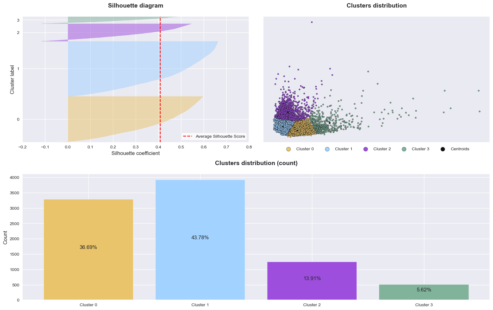
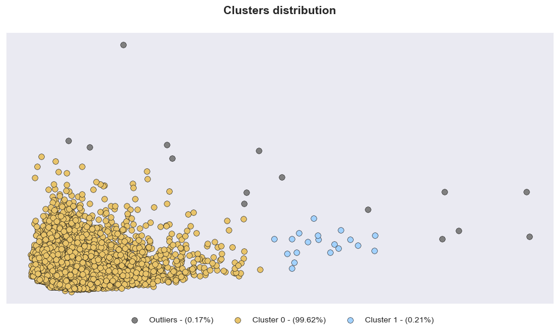

<!DOCTYPE html>
<html>
		
<body>

<h1>Machine Learning: Credit Card Clustering</h1>
This notebook was developed using Python and its libraries, utilizing a dataset from Kaggle to create a customer segmentation for defining a marketing strategy through clustering. The objective of this notebook is to group active credit card holders based on their usage behavior during the last 6 months, using 18 behavioral variables. The data is available <a href="https://www.kaggle.com/datasets/arjunbhasin2013/ccdata">here</a>. 

<h2>Dataset information</h2>
The dataset used for this customer segmentation task summarizes the usage behavior of approximately 9000 active credit card holders. Each entry in the dataset represents a customer and includes 18 behavioral variables that capture their credit card usage patterns.

<h2>Methodology</h2>

<h3>Exploratory Data Analysis</h3>
To gain insights into the dataset and understand the underlying patterns and relationships between variables, Exploratory Data Analysis (EDA) techniques were employed. EDA involved visualizing the data, identifying trends, and exploring possible correlations between features. This step helps inform subsequent preprocessing and modeling decisions.

<h3>Data Preprocessing</h3>
During data preprocessing, the following steps were applied to prepare the dataset for clustering:
<ul>
	<li><b>Missing Value Imputation:</b> Missing values in the dataset were handled using <code>KNNImputer</code>, which utilizes the k-nearest neighbors algorithm to impute missing values based on the information from neighboring samples.</li>
	<li><b>Standardization:</b> Numerical features were standardized using <code>StandardScaler</code>, ensuring that all features were on a similar scale. Standardization is crucial for clustering algorithms to work effectively, as it prevents features with larger scales from dominating the clustering process.</li>
  <li><b>Dimensionality Reduction:</b> Principal Component Analysis (PCA) was utilized to reduce the dimensionality of the data to 2. This transformation allowed for visualization of the data in a 2D space, making it easier to interpret the results of clustering.</li>
</ul>

<h3>Clustering Models</h3>
Two clustering algorithms, <code>K-Means</code> and <code>DBSCAN</code>, were experimented with to group customers based on their behavioral variables. K-Means is a centroid-based clustering algorithm, while DBSCAN is a density-based clustering algorithm. Both approaches have different strengths and may yield different cluster structures.

<h3>Model Selection and Profiling</h3>
After evaluating the performance of both clustering models, the K-Means model was selected for customer segmentation. The K-Means model was used to create distinct clusters of customers based on their credit card usage behavior. Once the clusters were defined, profiling of each cluster was conducted to gain insights into the characteristics and preferences of customers within each group. This information can be used to tailor marketing strategies and improve customer engagement.

<h2>Results</h2>

Below are the clusters obtained by each algorithm. Since K-Means had a better performance, it was chosen to do profiling.
 

<b>K-Means</b>

<b>DBSCAN</b>

</body>
</html>
